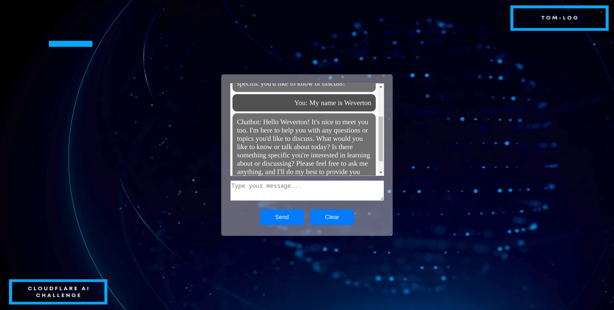

# Cloudflare Worker-powered Chatbot with Persistent Contextual Memory

This chatbot, crafted for the Cloudflare AI Challenge, is engineered to deliver a dynamic and seamless conversational experience, leveraging Cloudflare Workers and KV storage to ensure contextual continuity across user interactions.

## Features

- Intelligent dialogues with context persistence.
- Use of Cloudflare Workers and KV.
- Responses generated through the AI model `@cf/meta/llama-2-7b-chat-int8`.

## Demo

Check out a live demo of the chatbot [here](#https://contextual-conversation-worker.pages.dev/).

## Getting Started

Follow these instructions to get a copy of the project up and running on your local machine for development and testing purposes.

### Prerequisites

- A Cloudflare account
- Access to the Cloudflare dashboard

### Setup in the Dashboard

To create your Workers AI application using the Cloudflare dashboard:

1. Log in to the [Cloudflare dashboard](https://dash.cloudflare.com/) and select your account.
2. Select Workers & Pages > Create application.
3. Under 'Create using a template', select the LLM App. After you select your template, an AI binding will be automatically created in the dashboard.
4. Review the pre-generated code and select Deploy (copy the code worker.js and paste here).
5. Preview your Worker at the provided workers.dev subdomain.

### Local Development

If you wish to run the project locally for development:

1. Ensure you have the Wrangler CLI installed.
2. Set up your `wrangler.toml` with your account details and KV namespace.
3. Use `wrangler dev` to start the local development environment.

### Contributions

Contributions are welcome! Please send your suggestions through 'Issues' or 'Pull Requests'.
